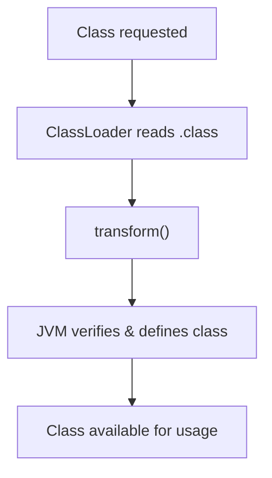

<h1 style="font-size: 3.5rem; line-height: 1.1;">
  Modern Java Static Analysis in the Presence of Reflection
</h1>

<br>

**Gauravsingh Sisodia**¹, Poorna Teja Pasala², **Aditya Anand**², and **Manas Thakur**²
<br>

¹ Sardar Patel Institute of Technology  
² Indian Institute of Technology Bombay


IICT

2 October 2026

Indian Institute of Science (IISc), Bengaluru

---
layout: two-cols-header
---

# Reflection in Java

##

Reflection allows programs to inspect and interact with program structure at runtime

::left::

<v-click>

```java {all|1-2|4|6-7|all}
String cls = args[0];
Class<?> c = Class.forName(cls);

Object obj = c.getDeclaredConstructor().newInstance();

Method m = c.getMethod("run");
m.invoke(obj);
```


How would a static analysis determine:

- Which class is loaded?
- Which method is invoked?

The call graph is incomplete at compile time

</v-click>

::right::

<v-click>

```java {all|1|3,9-13|5-6|8|all}
Connection c = new Connection();

Class<?> clazz = Generator.makeClass(); // → Foo$42

Method m = clazz.getMethod("foo", Connection.class);
m.invoke(null, c); // → Foo$42.foo(c)

c.write("risky call");

class Foo$42 {
    public static void foo(Connection c) {
        c.close();
    }
}
```

How would a static analysis access the runtime-generated class?

</v-click>


<SlideNumber />

<style>
.two-cols-header {
  column-gap: 20px; /* Adjust the gap size as needed */
}
</style>

---
layout: two-cols-header
---

# TamiFlex


<br>


::left::

<v-click>

### Which method is called?

- Records reflective calls and their targets
- Across multiple program executions
- Produces a reflection log
- Uses the log to guide static analysis

Sound only with respect to recorded executions!

</v-click>

::right::
<v-click>

### How to access the generated class?
- Capture every class loaded by the program
- Across multiple program executions
- Write them to disk

How to capture?

</v-click>
<SlideNumber />

<style>
.two-cols-header {
  column-gap: 20px; /* Adjust the gap size as needed */
}
</style>

<!-- --- -->
<!-- layout: two-cols-header -->
<!-- --- -->
<!---->
<!-- # TamiFlex -->
<!---->
<!-- ::right:: -->
<!-- <v-click> -->
<!---->
<!-- ### Approach -->
<!-- - Capture every class loaded by the program -->
<!-- - Across multiple executions -->
<!-- - Store them on disk -->
<!---->
<!-- </v-click> -->
<!---->
<!-- ::left:: -->
<!---->
<!-- ### How to access the runtime generated class? -->
<!---->
<!-- ```java -->
<!-- Connection c = new Connection(); -->
<!---->
<!-- Class<?> clazz = Generator.makeClass(); // → Foo$42 -->
<!-- Method m = clazz.getMethod("foo", Connection.class); -->
<!---->
<!-- m.invoke(null, c); // → Foo$42.foo(c) -->
<!-- c.write("risky call"); -->
<!---->
<!-- class Foo$42 { -->
<!--     public static void foo(Connection c) { -->
<!--         c.close(); -->
<!--     } -->
<!-- } -->
<!-- ``` -->
<!-- <SlideNumber /> -->
<!---->
<!-- <style> -->
<!-- .two-cols-header { -->
<!--   column-gap: 20px; /* Adjust the gap size as needed */ -->
<!-- } -->
<!-- </style> -->

---
layout: two-cols-header
---

# Java Instrumentation API

##
Intercept and modify bytecode as classes are loaded into the JVM

::left::

<v-click>

### Java Agent

- JAR file with a `premain` method

```bash
java -javaagent:agent.jar -jar application.jar
```


</v-click>

<v-click>

- Register class file transformers in premain

```java {all|8,10|all}
class Transformer implements ClassFileTransformer {

    public byte[] transform(
        ClassLoader loader,
        String name,
        Class<?> cls,
        ProtectionDomain pd,
        byte[] bytes // .class file
    ) {
        return modify(bytes);
    }
}
```

</v-click>

::right::
<v-click>

<div class="flex items-center justify-center h-full">



</div>

</v-click>

<SlideNumber />

---

# TamiFlex Architecture

<div class="relative w-full h-100 flex items-center justify-center">

<v-switch>
  <template #1>
    
  </template>
  <template #2>
    
  </template>
  <template #3>
    
  </template>
</v-switch>

</div>

<SlideNumber />

---

# TamiFlex Limitations

<v-click>

## Challenges

- Designed for Java 6/8-era applications
- Supports DaCapo 9.12-bach, but not DaCapo 23.11-MR2-chopin
- Breaks on Java 21 and recent JVMs


</v-click>

<v-click>

## Impact

- Static analysis research remains tied to old benchmarks

</v-click>

<v-click>

## Our Contribution

- Modernized TamiFlex for Java 21+

</v-click>

<SlideNumber />

<!-- --- -->
<!-- layout: two-cols-header -->
<!-- --- -->
<!---->
<!-- # Updating ASM -->
<!---->
<!-- ## ASM - Bytecode manipulation and analysis framework -->
<!---->
<!-- Used for modifying bytecode in `transform()` -->
<!---->
<!-- Provides APIs to parse class files and insert instructions -->
<!---->
<!-- <br> -->
<!---->
<!-- ::left:: -->
<!---->
<!-- <v-click> -->
<!---->
<!-- ### What changed? -->
<!---->
<!-- - TamiFlex used ASM 3.2 (Java 7) -->
<!---->
<!-- - Updated ASM to 9.9.1 (Java 26) -->
<!---->
<!-- - Migrated from deprecated `ClassAdapter` and `MethodAdapter` to `ClassVisitor` and `MethodVisitor` -->
<!---->
<!---->
<!-- </v-click> -->
<!---->
<!-- ::right:: -->
<!---->
<!-- <v-click> -->
<!---->
<!-- ### Example usage: -->
<!---->
<!-- ```java -->
<!-- ClassReader cr = new ClassReader(bytes); -->
<!-- ClassWriter cw = new ClassWriter(cr, 0); -->
<!---->
<!-- cr.accept(new MyClassVisitor(cw), 0); -->
<!---->
<!-- return cw.toByteArray(); -->
<!-- ``` -->
<!---->
<!---->
<!-- </v-click> -->
<!---->
<!-- <style> -->
<!-- .two-cols-header { -->
<!--   column-gap: 20px; /* Adjust the gap size as needed */ -->
<!-- } -->
<!-- </style> -->
<!---->
<!-- <SlideNumber /> -->

---
layout: two-cols-header
---

# Lambda Expressions

##
Allow behavior to be passed as data

::left::


<div v-show="$clicks < 9">

```java {all|4|3-4|all|all|all|6|hide}{at:3}
class Example {
    public static void main(String[] args) {
        Runnable r =
            () -> System.out.println("Hello");

        r.run();
    }
}

```

</div>

<div v-show="$clicks >= 9">

```java {6-7}
class Example {
    public static void main(String[] args) {
        Runnable r =
            () -> System.out.println("Hello");

        Class<?> cls = r.getClass();
        cls.getMethod("run").invoke(r);
    }
}
```

</div>


<v-click>
Introduced in Java 8

How are they compiled?


</v-click>

::right::
<v-click>

````md magic-move

```java {all|12-17|6} {at:3}
// Compiled from Example.java
class Example {
  ...
  public static void main(java.lang.String[]);
    Code:
       0: invokedynamic #7,  0
       5: astore_1
       6: aload_1
       7: invokeinterface #11,  1
      12: return

  private static void lambda$main$0();
    Code:
       0: getstatic     #15
       3: ldc           #21
       5: invokevirtual #23
       8: return
}
```
```java {all|11} {at:3}
// Generated at runtime
final class Example$$Lambda implements java.lang.Runnable {
  private Example$$Lambda();
    Code:
       0: aload_0
       1: invokespecial #10
       4: return

  public void run();
    Code:
       0: invokestatic  #16  // Method Example.lambda$main$0:()V
       3: return
}
```
```java {all|9} {at:3}
// Compiled from Example.java
class Example {
  ...
  public static void main(java.lang.String[]);
    Code:
       0: invokedynamic #7,  0
       5: astore_1
       6: aload_1
       7: invokeinterface #11,  1
      12: return

  private static void lambda$main$0();
    Code:
       0: getstatic     #15
       3: ldc           #21
       5: invokevirtual #23
       8: return
}
```
```java {8} {at:3}
// Compiled from Example.java
class Example {
  ...
  public static void main(java.lang.String[]);
    Code:
       0: invokedynamic #7,  0
      ...
      28: invokevirtual #24 // Method.invoke()
      31: pop
      32: return

  private static void lambda$main$0();
    Code:
       0: getstatic     #15
       3: ldc           #21
       5: invokevirtual #23
       8: return
}
```

````

</v-click>

<v-click>
But Java Instrumentation cannot capture these lambda classes
</v-click>

<style>
.two-cols-header {
  column-gap: 20px; /* Adjust the gap size as needed */
}
</style>

<SlideNumber />

---

# Mechanism to capture Lambdas

##
Hidden classes are instantiated by `makeHiddenClassDefiner` method in `java.lang.invoke.MethodHandles$Lookup`

The idea is to instrument that method to capture the `byte[]` that represents the class
<br>
<br>

<div class="relative w-full h-100">

<v-switch>
  <template #1>
    
  </template>

  <template #2>
    
  </template>

  <template #3>
    
  </template>

  <template #4>
    
  </template>
</v-switch>

</div>

<SlideNumber />
<!-- mechanism to capture it -->
<!---->
<!-- Why capture it? example from paper -->


---

# Mechanism to capture Lambdas

##
What about the reflection log?

<br>

<div class="relative w-full h-100">

<v-switch>
  <template #1>
    
  </template>

  <template #2>
    
  </template>

  <template #3>
    
  </template>
</v-switch>

</div>

<SlideNumber />

<!-- --- -->
<!-- layout: two-cols-header -->
<!-- --- -->
<!---->
<!-- # Non-deterministic bytecode -->
<!---->
<!-- ## -->
<!-- Sometimes runtime-generated classes might have different bytecode on each run -->
<!---->
<!-- ::left:: -->
<!---->
<!-- ### Why? -->
<!---->
<!-- Proxy classes rely on `Class.getMethods()` to generate classes -->
<!---->
<!-- This method does not guarantee a deterministic return order -->
<!---->
<!-- ```java -->
<!--          Run 1            |           Run 2 -->
<!--    Class.getMethods()     |     Class.getMethods() -->
<!--                           | -->
<!--       [ foo() ]           |         [ bar() ] -->
<!--       [ bar() ]           |         [ baz() ] -->
<!--       [ baz() ]           |         [ foo() ] -->
<!--           ↓               |             ↓ -->
<!--    Generated Class A      |     Generated Class A -->
<!--    0: call foo()          |     0: call bar() -->
<!--    1: call bar()          |     1: call baz() -->
<!--    2: call baz()          |     2: call foo() -->
<!-- ``` -->
<!---->
<!-- ::right:: -->
<!---->
<!-- ### The Fix -->
<!---->
<!-- Instrument `Class.getMethods()` to sort the `Method[]` before returning -->
<!---->
<!-- Algorithm: -->
<!---->
<!-- ```java -->
<!-- Arrays.sort(methods, -->
<!--     Comparator.comparing( -->
<!--         m -> m.getName() -->
<!--            + descriptor(m) -->
<!--            + m.getDeclaringClass().getName() -->
<!-- )); -->
<!-- ``` -->
<!---->
<!---->
<!-- <style> -->
<!-- .two-cols-header { -->
<!--   column-gap: 20px; /* Adjust the gap size as needed */ -->
<!-- } -->
<!-- </style> -->
<!---->
<!-- --- -->
<!-- layout: two-cols-header -->
<!-- --- -->
<!---->
<!-- # Non-deterministic bytecode -->
<!---->
<!-- ## -->
<!-- Sometimes runtime-generated classes might have different bytecode on each run -->
<!---->
<!-- ::left:: -->
<!---->
<!-- ### Why? -->
<!---->
<!-- ByteBuddy - a runtime code generation library -->
<!---->
<!-- Creates classes with randomized field names -->
<!---->
<!-- <div class="mt-4.8"> -->
<!---->
<!-- ```java -->
<!-- // Run 1: -->
<!--   private static final Method cachedValue$i9OL22LY$09i0gv1; -->
<!---->
<!-- // Run 2: -->
<!--   private static final Method cachedValue$oWiemhl0$09i0gv1; -->
<!-- ``` -->
<!---->
<!-- </div> -->
<!---->
<!-- <Arrow two-way=true width=1 x1="385" y1="310" x2="385" y2="345" /> -->
<!---->
<!-- ::right:: -->
<!---->
<!-- ### The Fix -->
<!---->
<!-- Instrument ByteBuddy's `RandomString` class -->
<!---->
<!-- Modify it to return a constant string - `"TAMIFLEX"` -->
<!---->
<!-- ```java -->
<!-- // Run 1: -->
<!--   private static final Method cachedValue$TAMIFLEX$09i0gv1; -->
<!---->
<!-- // Run 2: -->
<!--   private static final Method cachedValue$TAMIFLEX$09i0gv1; -->
<!-- ``` -->
<!---->
<!-- <Arrow two-way=true width=1 x1="850" y1="310" x2="850" y2="345" /> -->
<!---->
<!-- <style> -->
<!-- .two-cols-header { -->
<!--   column-gap: 20px; /* Adjust the gap size as needed */ -->
<!-- } -->
<!-- </style> -->

---
layout: two-cols-header
---

# Non-deterministic bytecode

##
Sometimes runtime-generated classes might have different bytecode on each run

::left::

<v-click>

### Dynamic proxy classes

- Generated at runtime for a set of interfaces

- Non-determinism in constant pool and member ordering

```java
Run 1:    ConstantPool [A, B, C]
          Methods [foo, bar]

Run 2:    ConstantPool [B, A, C]
          Methods [bar, foo]
```

<br>


</v-click>

<v-click>

### Fix

- Normalize the constant pool using ASM

- Sort class members into a deterministic order

</v-click>

::right::

<v-click>

### Unstable naming
- Names include two non-deterministic counters

- Example: `jdk.proxy2.$Proxy5`

- Hinder convergence

</v-click>

<v-click>

### Fix

- Normalize proxy class names

- Removing the counters

- Appending a hash of the bytecode

- New name: `jdk.proxy.$Proxy$HASHED$<hash>`
</v-click>

<style>
.two-cols-header {
  column-gap: 20px; /* Adjust the gap size as needed */
}
</style>

<SlideNumber />

---

# Additional Contributions

##
- Updated ASM version for compatibility till Java 26
- Scoped class dump directory with class loader name
- Added support for resolving default interface methods
- OpenJDK specific fixes


::left::

<v-click>
Classes can share a name but contain different bytecode


```java
// ClassLoader 1
org.example.Helper
    → m1()
    → m2()

// ClassLoader 2
org.example.Helper
    → m1()
```

</v-click>

<v-click>
TamiFlex does not distinguish between these two classes

Only the most recently observed class is retained

This causes conflicts in the Play-in agent

</v-click>

::right::


<style>
.two-cols-header {
  column-gap: 80px; /* Adjust the gap size as needed */
}
</style>

<SlideNumber />
---
layout: two-cols-header
---

# Evaluation

##
::left::

<v-click>

**Benchmark suite:**
DaCapo 23.11-MR2-chopin

**Java versions:**
OpenJDK 21 · OpenJ9 21

**Static analyzer:**
Soot

</v-click>

<v-click>

### Methodology

For all 22 benchmarks:

1. Generate reflection log and class dump with Play-out
2. Build call graph with Soot
3. Re-insert dumped classes with Play-in


</v-click>

::right::


<style>
.two-cols-header {
  column-gap: 50px; /* Adjust the gap size as needed */
}
</style>

<SlideNumber />

---
layout: two-cols-header
---


# Improvements in Static Analysis

##
Reproduced escape analysis from Anand et al. (PLDI 2024) using our updated TamiFlex

<!-- Compare Original TamiFlex+Soot (Base) with Updated TamiFlex+Soot (Newly enabled) on DaCapo 23.11-MR1-chopin -->
::left::


::right::


<SlideNumber />

---

# Publication


<br>

<v-click>

# Upstreaming

- We are in the process of merging our pull request into TamiFlex
<br>

- TamiFlex authors (Bodden et al.) welcomed our contributions and plan to include them in a future release


</v-click>
<SlideNumber />

---
layout: two-cols-header
---

# Conclusion
## Our work revives reflection-aware static analysis for modern Java

<br>

# Thank you

::left::

<br>
<br>
<br>


<br>
<br>
<br>

::right::

<br>


<br>

<SlideNumber />

---
layout: two-cols-header
---

# Call graph Correctness

##
::left::

Compared Soot-generated call graphs with dynamic call graphs

Ideally, every dynamic call graph edge should also appear in the static call graph


Some missing edges are expected and not relevant to this evaluation:

- Related to JVM mechanisms (`loadClass`)
- Reflective method edges
- And more


<br>
After excluding these cases, some edges are still missing

Potential opportunities to improve call graph algorithms

::right::


<style>
.two-cols-header {
  column-gap: 30px; /* Adjust the gap size as needed */
}
</style>

<SlideNumber />

