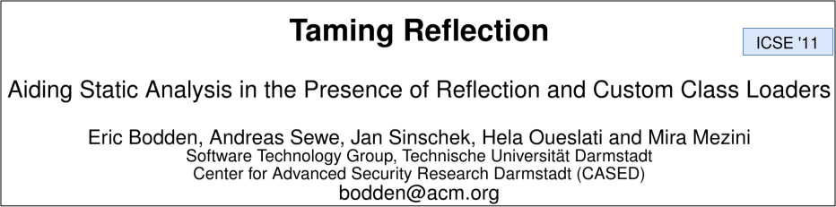
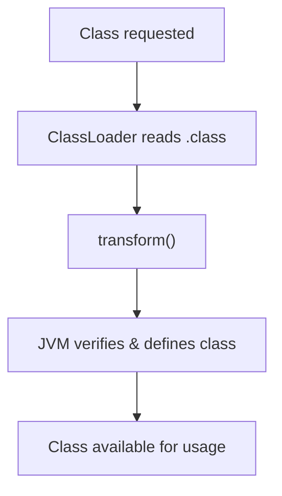
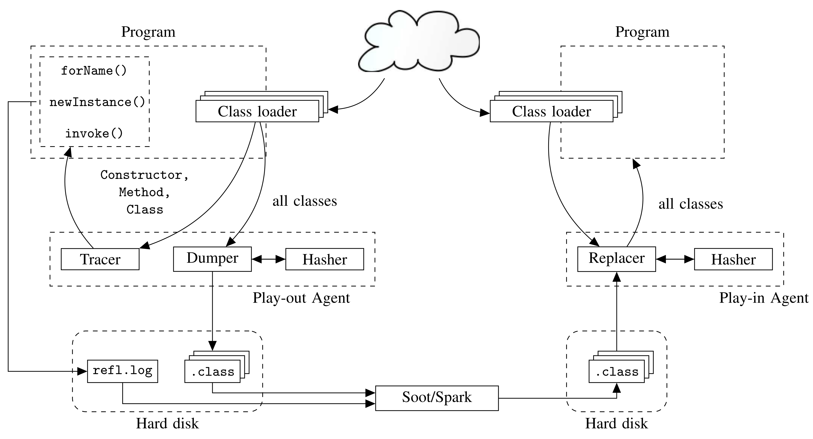

# Modern Java Static Analysis in the Presence of Reflection

<br>

### Gauravsingh Sisodia and Manas Thakur

<br>
<br>

IICT 2026

2 October 2026

Indian Institute of Science (IISc), Bengaluru

<SlideNumber />

---
layout: two-cols-header
---

# Reflection in Java

##

Reflection allows programs to inspect and modify behavior at runtime.

::left::

<v-click>

```java {all|1|3|4|6-7|all}
String cls = args[0];

Class<?> c = Class.forName(cls);
Object obj = c.getDeclaredConstructor().newInstance();

Method m = c.getMethod("run");
m.invoke(obj);
```


How would a static analysis determine:

- Which class is loaded?
- Which method is invoked?

At compile time the callgraph is incomplete

</v-click>

::right::

<v-click>

```java {all|1|3,9-13|6-7|all}
Connection c = new Connection();

Class<?> clazz = Generator.makeClass(); // → Foo$42
Method m = clazz.getMethod("foo", Connection.class);

m.invoke(null, c); // → Foo$42.foo(c)
c.write("risky call");

class Foo$42 {
    public static void foo(Connection c) {
        c.close();
    }
}
```

How would a static analysis access the runtime-generated class?

<!-- The target class and its bytecode are generated at runtime, so they may not even be present in the static analysis input. -->

</v-click>


<SlideNumber />

<style>
.two-cols-header {
  column-gap: 20px; /* Adjust the gap size as needed */
}
</style>

---
layout: two-cols-header
---

# TamiFlex



<br>

::right::
<v-click>

- Records reflective calls and their targets
- During various executions of the program
- Creates a reflection log
- Log can be used by the static analysis
- Only sound with respect to recorded runs


</v-click>

::left::

<v-click>

### Which method is invoked?

```java {6-7}
String cls = args[0];

Class<?> c = Class.forName(cls);
Object obj = c.getDeclaredConstructor().newInstance();

Method m = c.getMethod("run");
m.invoke(obj);
```

</v-click>
<SlideNumber />

<style>
.two-cols-header {
  column-gap: 20px; /* Adjust the gap size as needed */
}
</style>

---
layout: two-cols-header
---

# TamiFlex

::right::
<v-click>

- Capture every class loaded by the program at runtime
- Store it on disk
- Give to static analyzer

</v-click>

::left::

### How to access the runtime generated class?

```java {3,9-13}
Connection c = new Connection();

Class<?> clazz = Generator.makeClass(); // → Foo$42
Method m = clazz.getMethod("foo", Connection.class);

m.invoke(null, c); // → Foo$42.foo(c)
c.write("risky call");

class Foo$42 {
    public static void foo(Connection c) {
        c.close();
    }
}
```
<SlideNumber />

<style>
.two-cols-header {
  column-gap: 20px; /* Adjust the gap size as needed */
}
</style>

---
layout: two-cols-header
---

# Java Instrumentation API

##
Intercept and modify bytecode as classes are loaded into the JVM

::left::

<v-click>

### Java Agent

- JAR file with a premain method

```bash
java -javaagent:agent.jar -jar application.jar
```


</v-click>

<v-click>

- Register class file transformers in premain

```java {all|8,10}
class Transformer implements ClassFileTransformer {

    public byte[] transform(
        ClassLoader loader,
        String name,
        Class<?> cls,
        ProtectionDomain pd,
        byte[] bytes // .class file
    ) {
        return modify(bytes);
    }
}
```

</v-click>

::right::
<v-click>

<div class="flex items-center justify-center h-full">



</div>

</v-click>

<SlideNumber />

---

# TamiFlex Architecture



<Arrow
  v-click="1"
  v-click-hide="2"
  x1="50"
  y1="175"
  x2="115"
  y2="175"
  color="#F97316"
/>
<Arrow
  v-click="2"
  v-click-hide="3"
  x1="70"
  y1="350"
  x2="137"
  y2="350"
  color="#F97316"
/>
<Arrow
  v-click="4"
  v-click-hide="5"
  x1="515"
  y1="550"
  x2="515"
  y2="505"
  color="#F97316"
/>
<Arrow
  v-click="6"
  v-click-hide="7"
  x1="575"
  y1="350"
  x2="645"
  y2="350"
  color="#F97316"
/>


<SlideNumber />

---
layout: image-right
image: ./light-blue.jpg
---

# TamiFlex Limitations

## Challenges

- Designed for Java 6/8-era applications
- Supports DaCapo 9.12-bach, but not DaCapo 23.11-MR2-chopin
- Breaks on Java 21 and recent JVMs

## Impact

- Static analysis research remains tied to old benchmarks

## Our Contribution

- Modernized TamiFlex for Java 21+

<SlideNumber />

---
layout: two-cols-header
---

# Updating ASM

## ASM - Bytecode manipulation and analysis framework

Used for modifying bytecode in transform()

Provides APIs to parse class files and insert instructions

<br>

::left::

<v-click>

### What changed?

- TamiFlex used ASM 3.2 (Java 7)

- Updated ASM to 9.9.1 (Java 26)

- Migrated from deprecated `ClassAdapter` and `MethodAdapter` to `ClassVisitor` and `MethodVisitor`


</v-click>

::right::

<v-click>

### Example usage:

```java
ClassReader cr = new ClassReader(bytes);
ClassWriter cw = new ClassWriter(cr, 0);

cr.accept(new MyClassVisitor(cw), 0);

return cw.toByteArray();
```


</v-click>

<style>
.two-cols-header {
  column-gap: 20px; /* Adjust the gap size as needed */
}
</style>

<SlideNumber />

---

# Lambda Expressions

---


Challenges and fixes one by one

Evaluation and correctness


---

# Java Instrumentation

## How TamiFlex Observes Reflection

### Java Agent

- Uses the Java Instrumentation API
- Rewrites bytecode during class loading
- Intercepts reflective operations

### ASM

- Bytecode manipulation framework
- Visitor-based API
- Allows insertion of logging code

<!-- Optional ASM pipeline figure -->

---

# TamiFlex Components

<div class="grid grid-cols-3 gap-6">

<div class="border rounded p-4">

## Play-Out Agent

Runs with the application

Records reflective behavior

</div>

<div class="border rounded p-4">

## Play-In Agent

Uses recorded information

Makes reflective targets explicit

</div>

<div class="border rounded p-4">

## Booster

Transforms bytecode

Improves compatibility with static analysis tools

</div>

</div>

---

# Example Workflow

```text
Application
      │
      ▼
 Play-Out Agent
      │
 Reflection Log
      │
      ▼
 Play-In Agent
      │
      ▼
 Transformed Program
      │
      ▼
 Static Analysis
```

---

# Modernizing TamiFlex

### Original Version

- Java 6 / Java 8 era
- ASM 3.x
- DaCapo 9.12-bach

### This Work

- Java 21 support
- ASM 9.9.1
- DaCapo 23.11-MR2-chopin
- Hidden classes
- Lambda handling
- Modern JVM compatibility

---

# Evaluation

### Questions

1. Does TamiFlex work on modern Java?
2. Does it work on modern DaCapo benchmarks?
3. What issues arise on modern JVMs?

<!-- Results table goes here -->

---

# Key Takeaways

- Reflection remains challenging for static analysis
- TamiFlex bridges dynamic and static analysis
- Significant updates were required for modern Java
- Updated TamiFlex now supports contemporary JVMs and benchmarks

---

# Thank You

Questions?

### Contact

Gauravsingh Sisodia
