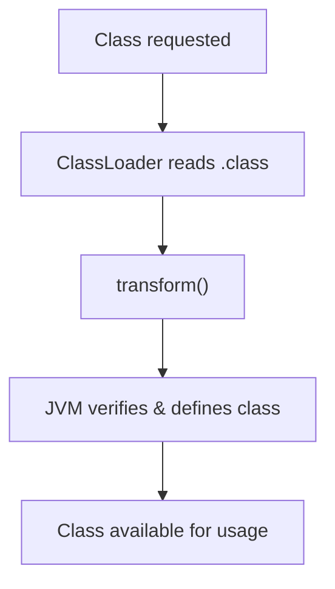

# Modern Java Static Analysis in the Presence of Reflection

<br>

### Gauravsingh Sisodia and Manas Thakur

<br>
<br>

IICT 2026

2 October 2026

Indian Institute of Science (IISc), Bengaluru

<SlideNumber />

---
layout: two-cols-header
---

# Reflection in Java

##

Reflection allows programs to inspect and modify behavior at runtime.

::left::

<v-click>

```java {all|1|3|4|6-7|all}
String cls = args[0];

Class<?> c = Class.forName(cls);
Object obj = c.getDeclaredConstructor().newInstance();

Method m = c.getMethod("run");
m.invoke(obj);
```


How would a static analysis determine:

- Which class is loaded?
- Which method is invoked?

At compile time the callgraph is incomplete

</v-click>

::right::

<v-click>

```java {all|1|3,9-13|6-7|all}
Connection c = new Connection();

Class<?> clazz = Generator.makeClass(); // → Foo$42
Method m = clazz.getMethod("foo", Connection.class);

m.invoke(null, c); // → Foo$42.foo(c)
c.write("risky call");

class Foo$42 {
    public static void foo(Connection c) {
        c.close();
    }
}
```

How would a static analysis access the runtime-generated class?

<!-- The target class and its bytecode are generated at runtime, so they may not even be present in the static analysis input. -->

</v-click>


<SlideNumber />

<style>
.two-cols-header {
  column-gap: 20px; /* Adjust the gap size as needed */
}
</style>

---
layout: two-cols-header
---

# TamiFlex


<br>

::right::
<v-click>

- Records reflective calls and their targets
- During various executions of the program
- Creates a reflection log
- Log can be used by the static analysis
- Only sound with respect to recorded runs


</v-click>

::left::

<v-click>

### Which method is invoked?

```java {6-7}
String cls = args[0];

Class<?> c = Class.forName(cls);
Object obj = c.getDeclaredConstructor().newInstance();

Method m = c.getMethod("run");
m.invoke(obj);
```

</v-click>
<SlideNumber />

<style>
.two-cols-header {
  column-gap: 20px; /* Adjust the gap size as needed */
}
</style>

---
layout: two-cols-header
---

# TamiFlex

::right::
<v-click>

- Capture every class loaded by the program at runtime
- Store it on disk
- Give to static analyzer

</v-click>

::left::

### How to access the runtime generated class?

```java {3,9-13}
Connection c = new Connection();

Class<?> clazz = Generator.makeClass(); // → Foo$42
Method m = clazz.getMethod("foo", Connection.class);

m.invoke(null, c); // → Foo$42.foo(c)
c.write("risky call");

class Foo$42 {
    public static void foo(Connection c) {
        c.close();
    }
}
```
<SlideNumber />

<style>
.two-cols-header {
  column-gap: 20px; /* Adjust the gap size as needed */
}
</style>

---
layout: two-cols-header
---

# Java Instrumentation API

##
Intercept and modify bytecode as classes are loaded into the JVM

::left::

<v-click>

### Java Agent

- JAR file with a premain method

```bash
java -javaagent:agent.jar -jar application.jar
```


</v-click>

<v-click>

- Register class file transformers in premain

```java {all|8,10}
class Transformer implements ClassFileTransformer {

    public byte[] transform(
        ClassLoader loader,
        String name,
        Class<?> cls,
        ProtectionDomain pd,
        byte[] bytes // .class file
    ) {
        return modify(bytes);
    }
}
```

</v-click>

::right::
<v-click>

<div class="flex items-center justify-center h-full">



</div>

</v-click>

<SlideNumber />

---

# TamiFlex Architecture


<Arrow
  v-click="[1, 2]"
  x1="50"
  y1="175"
  x2="115"
  y2="175"
  color="#F97316"
/>

<Arrow
  v-click="[2, 3]"
  x1="70"
  y1="350"
  x2="137"
  y2="350"
  color="#F97316"
/>

<Arrow
  v-click="[3, 4]"
  x1="515"
  y1="550"
  x2="515"
  y2="505"
  color="#F97316"
/>

<Arrow
  v-click="[4, 5]"
  x1="575"
  y1="350"
  x2="645"
  y2="350"
  color="#F97316"
/>


<SlideNumber />

---
layout: image-right
image: ./light-blue.jpg
---

# TamiFlex Limitations

## Challenges

- Designed for Java 6/8-era applications
- Supports DaCapo 9.12-bach, but not DaCapo 23.11-MR2-chopin
- Breaks on Java 21 and recent JVMs

## Impact

- Static analysis research remains tied to old benchmarks

## Our Contribution

- Modernized TamiFlex for Java 21+

<SlideNumber />

---
layout: two-cols-header
---

# Updating ASM

## ASM - Bytecode manipulation and analysis framework

Used for modifying bytecode in transform()

Provides APIs to parse class files and insert instructions

<br>

::left::

<v-click>

### What changed?

- TamiFlex used ASM 3.2 (Java 7)

- Updated ASM to 9.9.1 (Java 26)

- Migrated from deprecated `ClassAdapter` and `MethodAdapter` to `ClassVisitor` and `MethodVisitor`


</v-click>

::right::

<v-click>

### Example usage:

```java
ClassReader cr = new ClassReader(bytes);
ClassWriter cw = new ClassWriter(cr, 0);

cr.accept(new MyClassVisitor(cw), 0);

return cw.toByteArray();
```


</v-click>

<style>
.two-cols-header {
  column-gap: 20px; /* Adjust the gap size as needed */
}
</style>

<SlideNumber />

---
layout: two-cols-header
---

# Lambda Expressions

##
Allow behavior to be passed as data

::left::
```java {all|4|3-4|6|all}{at:2}
class Example {
    public static void main(String[] args) {
        Runnable r =
            () -> System.out.println("Hello");

        r.run();
    }
}
```

Introduced in Java 8

Not considered by TamiFlex

How are lambda expressions compiled?

::right::
<v-click>

````md magic-move

```java {all|12-17|6|9} {at:2}
// Compiled from Example.java
class Example {
  ...
  public static void main(java.lang.String[]);
    Code:
       0: invokedynamic #7,  0
       5: astore_1
       6: aload_1
       7: invokeinterface #11,  1
      12: return

  private static void lambda$main$0();
    Code:
       0: getstatic     #15
       3: ldc           #21
       5: invokevirtual #23
       8: return
}
```
```java {all|11}
// Generated at runtime
final class Example$$Lambda implements java.lang.Runnable {
  private Example$$Lambda();
    Code:
       0: aload_0
       1: invokespecial #10
       4: return

  public void run();
    Code:
       0: invokestatic  #16  // Method Example.lambda$main$0:()V
       3: return
}
```

````

</v-click>

<v-click>
This is a runtime generated class, it must be captured

But Java Instrumentation cannot capture hidden classes
</v-click>

<style>
.two-cols-header {
  column-gap: 20px; /* Adjust the gap size as needed */
}
</style>

<SlideNumber />

---
<!-- mechanism to capture it -->
<!---->
<!-- Why capture it? example from paper -->


---


Challenges and fixes one by one

Evaluation and correctness


---

# Thank You

Questions?

### Contact

Gauravsingh Sisodia
