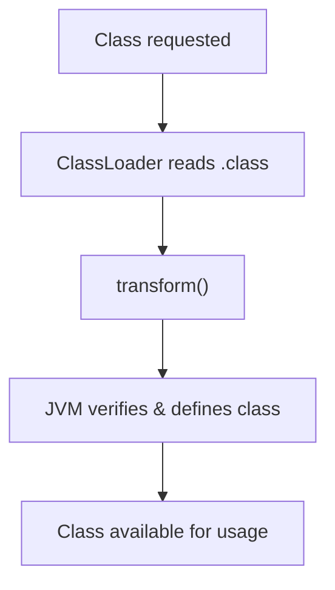

<h1 style="font-size: 3rem; line-height: 1.1;">
  Beyond Java 6: <br> Reviving Reflection-Aware Static Analysis for Modern JVMs
</h1>

<br>

Gauravsingh Sisodia¹, **Poorna Teja Pasala**², Aditya Anand², and **Manas Thakur**²
<br>

¹ Sardar Patel Institute of Technology  
² Indian Institute of Technology Bombay


---
layout: two-cols-header
---

# Reflection in Java

##

Reflection allows programs to inspect and interact with program structure at runtime

::left::

<v-click>

```java {all|1-2|4|6-7|all}
String cls = args[0];
Class<?> c = Class.forName(cls);

Object obj = c.getDeclaredConstructor().newInstance();

Method m = c.getMethod("run");
m.invoke(obj);
```


How would a static analysis determine:

- Which class is loaded?
- Which method is invoked?

The call graph is incomplete at compile time

</v-click>

::right::

<v-click>

```java {all|1|3,9-13|5-6|8|all}
Connection c = new Connection();

Class<?> clazz = Generator.makeClass(); // → Foo$42

Method m = clazz.getMethod("foo", Connection.class);
m.invoke(null, c); // → Foo$42.foo(c)

c.write("risky call");

class Foo$42 {
    public static void foo(Connection c) {
        c.close();
    }
}
```

How would a static analysis access the runtime-generated class?

</v-click>


<SlideNumber />

<style>
.two-cols-header {
  column-gap: 20px; /* Adjust the gap size as needed */
}
</style>

<!--
Let's start with some background.
What is reflection in Java. Read the line.

[click] Let's take an example.

[click] We have a command line argument which is passed to Class.forName
Class.forName loads the class from its name at runtime.

[click] We get its constructor and create a new instance of that class

[click] We get a method "run" from that class and use Method.invoke to reflectively invoke the method "run" on the object we created.

[click] Read the questions.
At compile time we can't figure out which class is loaded and which method is invoked.
We say that the call graph is incomplete at compile time.

[click] Let's take another example.

[click] We create a connection c, say a socket connection.

[click] We use Generator.makeClass to generate the bytecode of a class and load it at runtime.
This is possible in Java with the help of custom class loaders.
The generated class's name is Foo$42 and it contains a method foo which closes the connection passed into it.

[click] We get the "foo" method and call it using Method.invoke, this closes the connection.

[click] Then we attempt to write to that connection. This is a risky call.
For a static analysis to detect such a call we need access to the generated class.

[click] How would a static analysis access the generated class?
-->

---
layout: two-cols-header
---

# TamiFlex


<br>


::left::

<v-click>

### Which method is called?

- Records reflective calls and their targets
- Across multiple program executions
- Produces a reflection log
- Uses the log to guide static analysis

Sound only with respect to recorded executions!

</v-click>

::right::
<v-click>

### How to access the generated class?
- Capture every class loaded by the program
- Across multiple program executions
- Write them to disk

How to capture?

</v-click>
<SlideNumber />

<style>
.two-cols-header {
  column-gap: 20px; /* Adjust the gap size as needed */
}
</style>

<!--
A solution to these problems was introduced in 2011. It's called TamiFlex, Taming Reflection.
It is a tool which aids static analysis in the presence of reflection and custom class loaders.

[click] Let's see how it answers our first question, which method is called?
TamiFlex records reflective calls and their actual targets across multiple executions of the same program. This produces a reflection log file which can be given to the static analyzer to form a sound call graph.
Note that the call graph is only sound with respect to the recorded executions.

[click] Let's see how it answers our second question, how do we acess the generated class?
We capture every class loaded by the program across multiple program executions and we write all of them to disk.
But how to capture these classes, does Java provide any mechanism to do so?
-->

---
layout: two-cols-header
---

# Java Instrumentation API

##
Intercept and modify bytecode as classes are loaded into the JVM

::left::

<v-click>

### Java Agent

- JAR file with a `premain` method

```bash
java -javaagent:agent.jar -jar application.jar
```


</v-click>

<v-click>

- Register class file transformers in premain

```java {all|8,10|all}
class Transformer implements ClassFileTransformer {

    public byte[] transform(
        ClassLoader loader,
        String name,
        Class<?> cls,
        ProtectionDomain pd,
        byte[] bytes // .class file
    ) {
        return modify(bytes);
    }
}
```

</v-click>

::right::
<v-click>

<div class="flex items-center justify-center h-full">



</div>

</v-click>

<SlideNumber />

<!--
Yes, Java provides us with the Java Instrumentation API
It gives us the ability to intercept and modify bytecode as classes are loaded into the JVM.

[click] It does so with the help of a Java Agent. An agent is just a jar file with a premain method. This premain method is executed before the main method of the application. The command shows how to run an application alongside a java agent.

[click] In the premain method we can register ClassFileTransformers. Which is an interface which provides a transform method.

[click] With this method we can intercept the bytecode before it is loaded, modify it, and return the modified version back to be used by the JVM.

[click]

[click] This is the complete pipeline. A class is requested to be loaded, ClassLoader finds the .class file or it is generated at runtime, the transform() method is called on the class bytecode, JVM verifies if the bytecode is valid, the class is available for usage.
-->

---

# TamiFlex Architecture

<div class="relative w-full h-100 flex items-center justify-center">

<v-switch>
  <template #1>
    
  </template>
  <template #2>
    
  </template>
  <template #3>
    
  </template>
</v-switch>

</div>

<SlideNumber />

<!--
Let's take a look at how TamiFlex uses these Java agents by taking a look at its architecture.

[click] At the top left we have a program being executed, multiple class loaders can load classes into the program from the cloud. The cloud represents any source of a class file, it can be generated at runtime or be read from disk. When the Play-out agent is ran with the program it generates a reflection log and captures all the class files and stores them onto disk.

[click] Then the reflection log along with the class files is passed to Soot, which is a popular static analyzer for Java. Soot can transform the class file, maybe perform some optimizations, and dump the optimized class files onto the disk.

[click] Now we run the program again but with the Play-in agent, what this does is that whenever a ClassLoader tries to load a class from the cloud it checks to see if an optimized version of that class is available on disk and loads the optimized version instead.
-->
---

# TamiFlex Limitations

<v-click>

## Challenges

- Designed for Java 6/8-era applications
- Supports DaCapo 9.12-bach, but not DaCapo 23.11-MR2-chopin
- Breaks on Java 21 and recent JVMs


</v-click>

<v-click>

## Impact

- Static analysis research remains tied to old benchmarks

</v-click>

<v-click>

## Our Contribution

- Modernized TamiFlex for Java 21+

</v-click>

<SlideNumber />

<!--
That sounds good, what's the problem?

[click] TamiFlex was designed for Java 6/8-era applications.
It supports DaCapo 9.12, but not DaCapo 23.11. DaCapo benchmarks are a suite of real world benchmarks which heavily use reflection.
The newer DaCapo benchmarks support Java 21 and TamiFlex breaks on Java 21 and recent JVMs.

[click] The impact of this is that static analysis research remains tied to old benchmarks.

[click] Our contribution is that we have modernized TamiFlex for Java 21 and above. We handled the new features introduced in Java. With our work TamiFlex can now analyze the newer DaCapo benchmarks.
-->

---
layout: two-cols-header
---

# Updating ASM

## ASM - Bytecode manipulation and analysis framework

Used for modifying bytecode in `transform()`

Provides APIs to parse class files and insert instructions

<br>

::left::

<v-click>

### What changed?

- TamiFlex used ASM 3.2 (Java 7)

- Updated ASM to 9.9.1 (Java 26)

- Migrated from deprecated `ClassAdapter` and `MethodAdapter` to `ClassVisitor` and `MethodVisitor`


</v-click>

::right::

<v-click>

### Example usage:

```java
ClassReader cr = new ClassReader(bytes);
ClassWriter cw = new ClassWriter(cr, 0);

cr.accept(new MyClassVisitor(cw), 0);

return cw.toByteArray();
```


</v-click>

<style>
.two-cols-header {
  column-gap: 20px; /* Adjust the gap size as needed */
}
</style>

<SlideNumber />

<!--
We started with updating the ASM version.
ASM is a bytecode manipulation and analysis framework.
It is used for modifying and instrumenting the bytecode in the transform method.
It provides APIs to parse class files and insert instructions.

[click] What changed?
TamiFlex used an older version of ASM 3.2 which supports java class files only upto Java 7. We updated it to ASM 9.9.1 which supports class files upto Java 26. As a part of this, we had to migrate from the deperecated Class and Method adapters to the newer visitor API.

[click] Example:
bytes is a byte array representing the class bytecode.
It can be parsed with ClassReader, the reader can be used to create a ClassWriter and the reader can then accept a visitor.
The ClassWriter can convert the class back to a byte array
-->

---
layout: two-cols-header
---

# Lambda Expressions

##
Allow behavior to be passed as data

::left::


<div v-show="$clicks < 9">

```java {all|4|3-4|all|all|all|6|hide}{at:3}
class Example {
    public static void main(String[] args) {
        Runnable r =
            () -> System.out.println("Hello");

        r.run();
    }
}

```

</div>

<div v-show="$clicks >= 9">

```java {6-7}
class Example {
    public static void main(String[] args) {
        Runnable r =
            () -> System.out.println("Hello");

        Class<?> cls = r.getClass();
        cls.getMethod("run").invoke(r);
    }
}
```

</div>


<v-click>
Introduced in Java 8

How are they compiled?


</v-click>

::right::
<v-click>

````md magic-move

```java {all|12-17|6} {at:3}
// Compiled from Example.java
class Example {
  ...
  public static void main(java.lang.String[]);
    Code:
       0: invokedynamic #7,  0
       5: astore_1
       6: aload_1
       7: invokeinterface #11,  1
      12: return

  private static void lambda$main$0();
    Code:
       0: getstatic     #15
       3: ldc           #21
       5: invokevirtual #23
       8: return
}
```
```java {all|11} {at:3}
// Generated at runtime
final class Example$$Lambda implements java.lang.Runnable {
  private Example$$Lambda();
    Code:
       0: aload_0
       1: invokespecial #10
       4: return

  public void run();
    Code:
       0: invokestatic  #16  // Method Example.lambda$main$0:()V
       3: return
}
```
```java {all|9} {at:3}
// Compiled from Example.java
class Example {
  ...
  public static void main(java.lang.String[]);
    Code:
       0: invokedynamic #7,  0
       5: astore_1
       6: aload_1
       7: invokeinterface #11,  1
      12: return

  private static void lambda$main$0();
    Code:
       0: getstatic     #15
       3: ldc           #21
       5: invokevirtual #23
       8: return
}
```
```java {8} {at:3}
// Compiled from Example.java
class Example {
  ...
  public static void main(java.lang.String[]);
    Code:
       0: invokedynamic #7,  0
      ...
      28: invokevirtual #24 // Method.invoke()
      31: pop
      32: return

  private static void lambda$main$0();
    Code:
       0: getstatic     #15
       3: ldc           #21
       5: invokevirtual #23
       8: return
}
```

````

</v-click>

<v-click>
But Java Instrumentation cannot capture these lambda classes
</v-click>

<style>
.two-cols-header {
  column-gap: 20px; /* Adjust the gap size as needed */
}
</style>

<SlideNumber />

<!--
Another feature we had to handle is lambda expressions.
Lambda expressions allow behavior to be passed as data.
This is an example where we define a lambda expression and call it, it simply prints "Hello".

[click] These were introduced in Java 8, so they were not handled in TamiFlex. Let's take a look at how they are compiled.

[click] This is the compiled JVM bytecode of the code on the left.

[click] We can see that the body of the lambda is compiled into a private static method lambda main 0 in the class. It prints "hello".

[click] Let's take a look at how the lambda is defined. What we would expect here is that we should have a class which implements the Runnable interface and then create a new instance of that class and store it into `r`. But we have a instruction invokedynamic here. invokedynamic does all of that but it does so at runtime. So it creates a class at runtime.

[click] This is the generated class at runtime, it implements the Runnable interface, it consists of the constructor and the run() method.

[click] The run method calls the body of the lambda, which is stored in lambda main 0 method in our Example class.

[click] Let's go back to our compiled Example.

[click] Let's look at how the lambda is called. It is called using invokeinterface. Static analyzers such as soot can handle the combination of invokedynamic and invokeinterface, but what they can't handle is this:

[click] They can't handle it if the lambda is invoked reflectively using Method.invoke. Although it is rare to call a lambda reflectively but it is allowed. It is more likely for some introspective reflective methods to be called on the lambda, but we use this as an example.

[click] We need to capture the class generated at runtime by invokedynamic. But lambda classes are implemented as hidden classes and can't be captured by the Java instrumentation API. So we came up with a mechanism to capture these lambda classes.
-->

---

# Mechanism to capture Lambdas

##
Hidden classes are instantiated by `makeHiddenClassDefiner` method in `java.lang.invoke.MethodHandles$Lookup`

The idea is to instrument that method to capture the `byte[]` that represents the class
<br>
<br>

<div class="relative w-full h-100">

<v-switch>
  <template #1>
    
  </template>

  <template #2>
    
  </template>

  <template #3>
    
  </template>

  <template #4>
    
  </template>
</v-switch>

</div>

<SlideNumber />

<!-- 
Hidden classes are instantiated by makeHiddenClassDefiner method in that class.
The idea is to target the source by instrumenting the method which defines those classes to capture the byte array of the class.

[click] We have the makeHiddenClassDefiner method and we insert a call to our own method before returning.

[click] Our method processHiddenClass takes the bytecode, extracts the class name, removes the non-deterministic address from the lambda's name and replaces it with a hash of its bytecode. This is done to uniquely identify the class across multiple program executions.

[click] We then remap the bytecode to the hashed versions and pass it to the dumper for dumping to disk.

[click] We then add a new field to this class named TAMIFLEX HASH, this contains the hashed class name. And return the bytecode back to complete the hidden class definition. We'll see why we added this in the next slide.
-->

---

# Mechanism to capture Lambdas

##
What about the reflection log?

<br>

<div class="relative w-full h-100">

<v-switch>
  <template #1>
    
  </template>

  <template #2>
    
  </template>

  <template #3>
    
  </template>
</v-switch>

</div>

<SlideNumber />

<!--
So that was about capturing the generate lambda class file. What about creating an entry in the reflection log file?

[click] We capture the targets to a reflective method call by instrumenting the reflection method itself, we add a call to our own method before returning.

[click] The problem here is that we only have access to the java.lang.Class object representing the class, we don't have access to the bytecode, but we took a hash of the bytecode and appended it to the name before dumping, we need that hash to associate the class name in the dump and the log file.

[click] That's why we added the hashed name as a field in the class file itself which we can access reflectively. We can check if that field exists and then use the field's value as the name or just use Class.getName as the default to add the new log entry.
-->
---
layout: two-cols-header
transition: fade
---

# Non-deterministic bytecode

##
Sometimes runtime-generated classes might have different bytecode on each run

::left::

<v-click>

### Dynamic proxy classes

- Generated at runtime for a set of interfaces

- Non-determinism in constant pool and member ordering

```java
Run 1:    ConstantPool [A, B, C]
          Methods [foo, bar]

Run 2:    ConstantPool [B, A, C]
          Methods [bar, foo]
```


</v-click>

<v-click>

### Fix

- Normalize the constant pool using ASM

- Sort class members into a deterministic order

</v-click>

::right::

<v-click>

### Unstable naming
- Names include two non-deterministic counters

- Example: `jdk.proxy2.$Proxy5`

- Hinder convergence

</v-click>

<v-click>

### Fix

- Normalize proxy class names

- Removing the counters

- Appending a hash of the bytecode

- New name: `jdk.proxy.$Proxy$HASHED$<hash>`
</v-click>

<style>
.two-cols-header {
  column-gap: 20px; /* Adjust the gap size as needed */
}
</style>

<SlideNumber />

<!--
Another thing we had to handle is non-deterministic bytecode.
Sometimes runtime-generated classes might have different bytecode on each run for the same class.

[click] This is observed in dynamic proxy classes, these are generated at runtime for a set of interfaces. They show non-determinism in their constant pool and method ordering. On one run a proxy class can have order ABC in the constant pool and on another run it can have order BAC. Same for the methods and the fields.

[click] We fixed this by using ASM to normalize the constant pool. And also sort the class members into a deterministic order before doing any processing.

[click] Another problem with these dynamic proxy classes is the unstable naming. The names for these classes include two non-detereministic counters, like 2 and 5 in the example shown. These counters can change for the same class on different runs. This hinders convergence.

[click] We fixed this by normalizing these proxy class names by removing the counters and appending the hash of the bytecode to the name. The new name format is displayed.
-->

---
layout: two-cols-header
---

# Non-deterministic bytecode

##
Sometimes runtime-generated classes might have different bytecode on each run

::left::

### Why?

ByteBuddy - a runtime code generation library

Creates classes with randomized field names

<div v-click class="mt-4.8">

```java
// Run 1:
  private static final Method cachedValue$i9OL22LY$09i0gv1;

// Run 2:
  private static final Method cachedValue$oWiemhl0$09i0gv1;
```

</div>

<Arrow v-after two-way=true width=1 x1="385" y1="310" x2="385" y2="345" />

::right::
<v-click>

### Fix

Instrument ByteBuddy's `RandomString` class

Modify it to return a constant string - `"TAMIFLEX"`

```java
// Run 1:
  private static final Method cachedValue$TAMIFLEX$09i0gv1;

// Run 2:
  private static final Method cachedValue$TAMIFLEX$09i0gv1;
```

<Arrow two-way=true width=1 x1="850" y1="310" x2="850" y2="345" />

</v-click>

<style>
.two-cols-header {
  column-gap: 20px; /* Adjust the gap size as needed */
}
</style>

<SlideNumber />

<!--
Another instance of bytecode non-determinism comes from ByteBuddy which is a runtime code generation library.
It creates classes with randomized field names.

[click] For example, here the arrows point to the randomized values, these values vary across runs for the same class file.

[click] We fixed this by instrumenting bytebuddy's random string class. We modify it to return a constant string "TAMIFLEX" instead.
-->

---
layout: two-cols-header
---


# Classes with identical names

##
Multiple classes can share a name if loaded by different class loaders

::left::

<v-click>
Classes can share a name but contain different bytecode


```java
// ClassLoader 1
org.example.Helper
    → m1()
    → m2()

// ClassLoader 2
org.example.Helper
    → m1()
```

</v-click>

<v-click>
TamiFlex does not distinguish between these two classes

Only the most recently observed class is retained

This causes conflicts in the Play-in agent

</v-click>

::right::


<style>
.two-cols-header {
  column-gap: 80px; /* Adjust the gap size as needed */
}
</style>

<SlideNumber />

<!--
We also had to handle classes with identical names.
Multiple classes can share a name if loaded by different class loaders. A class in Java is identified by its fully qualified name and its class loader.

[click] Classes can share the fully qualified name but contain different bytecode. Like in this example we have two classes with the same name being loaded by two different loaders. One of them contains the method m2 and the other doesn't. We observed this case in the DaCapo benchmarks.

[click] TamiFlex does not distinguish between these classes and retains only the most recently observed class. This can cause conflict in the Play-in agent when an unexpected class is loaded when another is expected.

[click] To fix this we updated TamiFlex class dump directory format to scope it by class loader name. The new format allows us to store both the copies if the fully qualified name is the same. This also requires some modification in the way soot is called, which is given below.
-->

---
layout: two-cols-header
---

# Evaluation

##
::left::

<v-click>

**Benchmark suite:**
DaCapo 23.11-MR2-chopin

**Java versions:**
OpenJDK 21 · OpenJ9 21

**Static analyzer:**
Soot

</v-click>

<v-click>

### Methodology

For all 22 benchmarks:

1. Generate reflection log and class dump with Play-out
2. Build call graph with Soot
3. Re-insert dumped classes with Play-in


</v-click>

::right::


<style>
.two-cols-header {
  column-gap: 50px; /* Adjust the gap size as needed */
}
</style>

<SlideNumber />

<!--
For our evaluation

[click] We evaluated this on the DaCapo 23.11 benchmark soot, on two different JVMs, OpenJDK and OpenJ9, both using Java 21. We used Soot as our static analyzer.

[click] For all 22 benchmarks of the DaCapo benchmark suite we were able to generate the reflection log and the class dump directory with the Play-out agent, build a call graph with soot, and re-insert dumped classes with the Play-in agent. We were able to do all of this successfully.

[click] This is a graph showing the number of log entries in orange and the size of the call graph in blue for all 22 benchmarks in the newer DaCapo 23.11 benchmark suite. This was not possible to compute before our work.
-->

---
layout: two-cols-header
---

# Call graph Correctness

##
::left::
<v-click>
Compared Soot-generated call graphs with dynamic call graphs

Ideally, every dynamic call graph edge should also appear in the static call graph
</v-click>

<v-click>
Some missing edges are expected and not relevant to this evaluation:

- Related to JVM mechanisms (`loadClass`)
- Reflective method edges
- And more
</v-click>

<br>
<v-click>
After excluding these, some edges are still missing

Potential opportunities to improve call graph algorithms
</v-click>

::right::


<style>
.two-cols-header {
  column-gap: 30px; /* Adjust the gap size as needed */
}
</style>

<SlideNumber />

<!--
How do we know if these are all of the changes that are required? To check that we did a call graph correctness analysis.

[click] We compared soot-generated call graphs with dynamic call graphs. Ideally every dynamic call graph edge should also appear in the static call graph.

[click] But some missing edges are expected and not relevant for our evaluation. These are related to JVM internal mechanisms such as `loadClass`, reflective method edges which we ignore and insert edges directly to the targets we recorded, and more such edges we have classified in our paper.

[click] Even after excluding these edges, some edges are still missing from the static call graph. These are potential opportunities to improve the implementation of the call graph algorithms.

[click] This graph shows the number of missing edges for various DaCapo benchmarks, the blue bar shows missing edges with Spark, the orange bar shows the number of missing edges with CHA. For Spark we were able to create a minimal reproducible example of a bug, so spark misses a lot of edges due to a bug. CHA is a more conservative algorithm and it misses fewer edges than Spark. These edges can be used to improve the call graph algorithms.
-->

---
layout: two-cols-header
---


# Improvements in Static Analysis

##
Reproduced escape analysis from Anand et al. (PLDI 2024) using our updated TamiFlex

<!-- Compare Original TamiFlex+Soot (Base) with Updated TamiFlex+Soot (Newly enabled) on DaCapo 23.11-MR1-chopin -->
::left::


::right::


<SlideNumber />

<!--
We also tested our updated TamiFlex on an existing static analysis. We reproduced the escape analysis from Anand et al's PLDI 2024 paper.

[click] These show the number of objects that we were able to analyze on various benchmarks. The blue bar shows the number of objects analyzed with JDK8 with older TamiFlex and the orange bar shows the additional objects which are analyzed when we use JDK21.

[click] Because the number of objects analyzed is more, there are also more stack allocation opportunities, we see a signficant increase in the number of stack allocation opportunities. This shows that our updated TamiFlex can be used on existing static analysis to evaluate them on newer JDKs and newer versions of the DaCapo benchmarks.
-->

---

# Upstreaming

- Our work has been merged into TamiFlex
<br>

- Working with the TamiFlex authors (Bodden et al.) to do a release soon

<SlideNumber />

---
layout: two-cols-header
---

# Conclusion
## Our work revives reflection-aware static analysis for modern Java

<br>

# Thank you

::left::

<br>
<br>
<br>


<br>
<br>
<br>

::right::

<br>


<br>

<SlideNumber />
